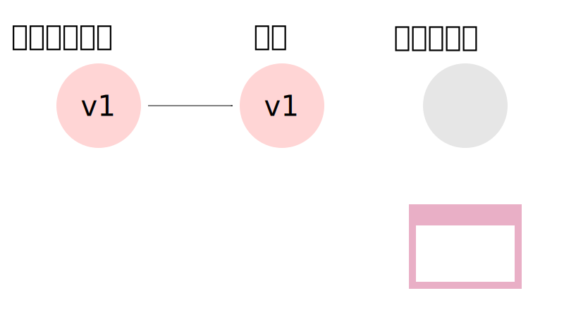
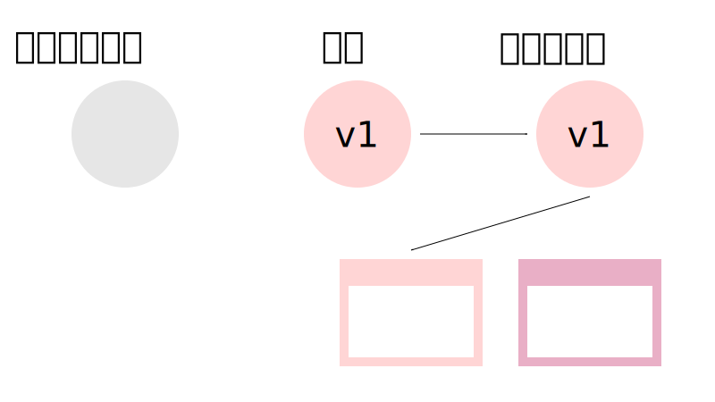
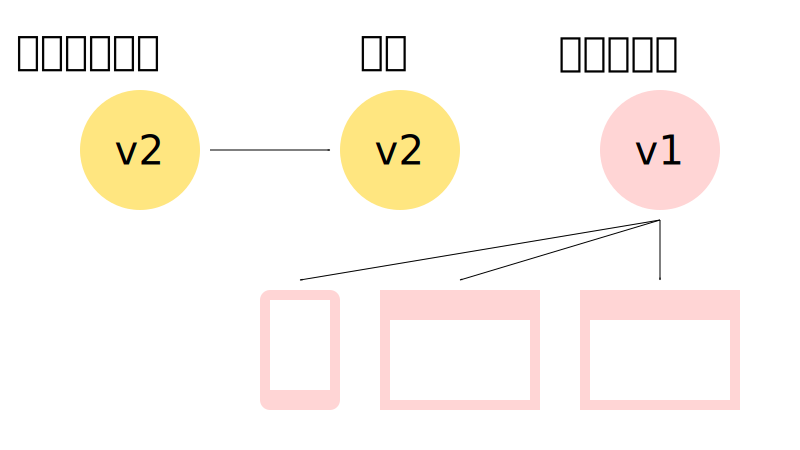
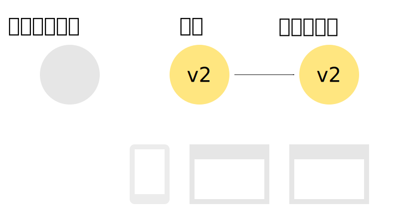
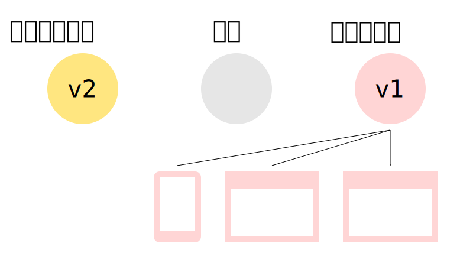
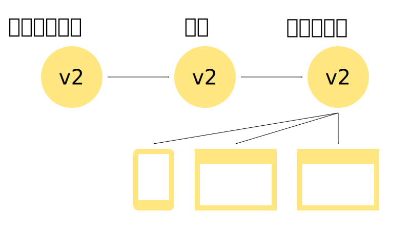

# PWAの概要とライフサイクルを知る

---

## PWAとは

Progressive Web Apps(PWA)とは、HTML5で動作するページをネイティブアプリっぽく実行することが可能になる技術です。

ブラウザでアクセスすれば普通のWebアプリとして使えますが、インストールすることでネイティブアプリっぽく実行することも可能です。

有名どころではTwitter（モバイル版）やInstagramなどもPWA対応をしています。

+++

### PWA以前の様々な取り組み

PWA以前にも実はWebアプリの「ネイティブアプリ化」技術がありました。

* Chromeのアプリケーション化
    * デスクトップにそのWebページを一発で開くショートカットを作り、起動時にはURLバーの排除など、よりアプリっぽく動作する
    * 個人的にはPWAの前身と思ってる。かなり昔からChromeに搭載されている機能
* アクティブデスクトップ/デスクトップガジェット
    * Windowsに搭載されていたWebアプリをデスクトップに設置する技術
        * 前者はWin98から正式搭載されていたらしいがVistaで廃止。使ったことない
        * Vistaではガジェットが搭載され（結構気に入っていたのに）7では廃止

+++

* Electronとか
    * Chrome+Node.jsを混ぜた各OSで動くアプリに、Webアプリを混ぜてそれっぽく実行する類のやつ
    * SlackとかVisualStudio Code等採用事例も多いが、ファイル容量が大きい、Webアプリ以外の実装部分が大きくなりがち
        * もちろん設計次第ではあるが
    * それ以外は概ねいい感じだと思っている

+++

### PWA以前の類似技術はぱっとしない

他にもいろいろとあるはずですが、これらはあまり使われなかったり廃止されたりとあんまりぱっとしないで忘れ去られるのが多いです。

* Webアプリが可能なことが貧弱すぎ、ネイティブアプリとして使うには力不足過ぎた
* 上を補うために独自APIを提供しても、独自仕様なので他で使えない＝開発コストが大きくなる

Electron系は技術系ではよく使われているが、新規Webサービスでお手軽に！というより、技術に余力のある企業しか採用してない気が。

+++

### 類似技術廃れてるけど流行るの？

思ったより早く浸透しているので、流行るというより、当たり前の技術になっていく可能性が。

* Chromeウェブストアから「Chrome Apps」のセクション削除--PWAに移行へ
    * https://japan.cnet.com/article/35111628/
* Microsoft、年内に「Progressive Web Apps」（PWA）をアプリストアに追加へ
    * http://www.itmedia.co.jp/news/articles/1802/08/news067.html
* iOSのSafariでPWAがいよいよ動くようになった、iOS 11.3ベータ版がService Workerを本格的にサポート開始
    * https://www.suzukikenichi.com/blog/pwa-finally-begins-working-in-ios-safari/


---

## PWAの特徴

PWAは主に以下の構造に分かれています。

* Webアプリ部分
    * 通常のHTML5による実装
    * PWA専用のAPIはそんなに多いわけではなく、登録や通信程度
* それ以外
    * ブラウザの制御とかPush通知の処理とかを行う、少し特殊なJS実装
    * WebアプリとPWAの主だった差分部分はここ

+++

### PWAが（それ以外の部分で）できること

* ブラウザの制御
    * 通信やWebページ立ち上げなど一部ではあるがWebページの領域を超えたブラウザの制御が可能
* キャッシュの制御
* 停止時の活動
    * Webページを開いていなくてもPush通知を受け取った際にそのアプリに応じた処理が可能
    * バックグラウンドで待機し、オンラインになった時に通信を再開するなど
* デバイスへのインストール
    * スマートフォンのアプリインストールをより簡単にしたようなもの
    * ページのダウンロード+α程度なのでそんなに時間もかからない
    * 基本的にOSに依存しているので、場合によってはPWAは対応しているがインストールは対応してないとかいう状況もありうる

+++

### 考慮するOS/ブラウザ

PWAはブラウザだけでなくOSの影響もうけるため、特に注意しておくべきOS/ブラウザが以下になります。

* Android/Chrome
* Mac/iOS/Safari
* Windows/Edge

Firefox等もいろいろ対応していますが、主に上については情報を積極的に集めた方が良いです。

+++

### PWAのメリット

* アプリインストールの煩わしさが軽減
    * PWAはブラウザで動作するので利用するだけならインストール不要
    * 多用するならインストールできるし、軽量、自動アップデート
* ネイティブアプリ開発しなくてもそれっぽくできる
    * PWAをOSから開くとURLバーが消せたりもでき、ブラウザっぽさを感じさせないことも可能
    * 新規Webサービスは、初めからPWA対応しておけば疑似アプリとして利用可能
        * アプリは審査も必要でコストが高い
* Single Page Application(SPA)との相性が非常に良い

+++

### デメリット

* ネイティブよりパフォーマンスは劣る
    * 結局ブラウザの上で動くものなので、パフォーマンスはネイティブに劣る
* OS/ブラウザの対応が必要
    * 単に動作するだけならブラウザ対応だけでOK
    * ただし、アプリインストールなどはほぼOSに依存するため、OSの対応なしでは完全な状態で利用できない
* SPA以外との相性が悪い
    * ページ遷移がたくさん発生するCGIみたいな形式でもできなくはないが、オフライン対応などで少々辛い
    * オフライン時の動作を使用不可ページを表示するだけ、というようにばっさり切るならまだいける

+++

### PWAの対応条件(ブラウザ側)

PWAに必要な機能は以下です。

* Web App Manifest
    * https://caniuse.com/#search=Web%20App%20Manifest
    * デバイスへのインストールに必要
    * iOS Safari用にアイコンとか用意したらWebページをホームに追加した時反映されたと思うが、あれをひとまとめにして分離したもの
* ServiceWorker(SW)
    * https://caniuse.com/#search=Service%20Workers
    * PWAの主機能を担う部分。今回の実装のメイン

対象のブラウザがこれらをサポートしていれば、PWAに対応していると言えます。

+++

### PWAの動作条件(Webアプリ側)

PWAは強力故に不正な攻撃をされると非常に危険です。
そのため以下の動作条件がアプリに課せられます。

* HTTPS通信もしくはローカルホスト(localhostや自分のIPアドレスなら可)

手元での開発にもWebサーバーが必要なことと、社内の開発環境でもHTTPSが必要です。

---

## 初めてのPWA

ここからは最低限のPWAの実装と、重要なライフサイクル周りの挙動をサンプルを交えながら実践していきます。

開発環境は以下とします。

* Chrome(シークレットウィンドウ)
    * 開発者モード実行時に壊れたりしたときリセットしやすい
    * 最初の登録からやり直したいときにシークレットウィンドウを閉じるだけで良い
    * Canaryをインストールすれば今使っているChromeとは完全に別環境で実験できる
* Webサーバー
    * 何でもいいのでローカルでhttpか外部でhttpsで接続できる状態に
        * GitHub Pagesも独自ドメインを使わなければHTTPS対応しているので、テストならそれでも可
    * localhostや自分のIPアドレスならポート番号等は特に気にしなくても問題ない

+++?code=docs/manifest.json&title=/Slide_PWA_0/manifest.json

とりあえずこれ以降触ることのないManifestから作っておきます。
これがPWAのサイトの設定で、インストールされたときにここの情報を参照し、アイコンや名前などを設定します。
同時に144x144の `/icon-144.png` も用意しておきます。

+++?code=docs/0_minimal/sw.js&title=/Slide_PWA_0/0_minimal/sw.js

最も簡単なSW（何もしない空ファイル）を作ります。
ファイルとして存在していることは重要なので、ファイルだけは作ってください。


+++?code=docs/0_minimal/index.html&title=/Slide_PWA_0/0_minimal/index.html

Webアプリをミニマルな状態で作ります。

Web App ManifestとSWを登録することしかしていません。

+++

### ServiceWorker登録関数の説明

```
function InitServiceWorker() {
    if ( !( 'serviceWorker' in navigator ) ) { return; }
    navigator.serviceWorker.register( '/sw.js', {scope: '/'} );
}
```
@[2](navigatorにserviceWorkerがない場合は登録作業をしない)
@[3](実際の登録作業で、scopeはSWの動作範囲)

+++

### 今回のコード

```
function InitServiceWorker() {
    if ( !( 'serviceWorker' in navigator ) ) { return; }
    navigator.serviceWorker.register( './sw.js', {scope: './'} );
}
```

SWは同じサイトであっても対象となるスコープ=パスが異なれば複数設置可能なので、今回はサンプルをいくつか用意する都合上、このようなコードとなります。

+++

### PWAの確認について

初めにも書いたように、基本はChromeのシークレットウィンドウで確認しましょう。

今回はどちらかというと最低限のPWAのサンプルなので、PWA対応のスマートフォンのブラウザで開いてみると良いです。

具体的には現段階ではAndroidのChrome最新版であれば、以下の条件を満たすとホームに追加通知が出ますが、条件は暫定です。

* 複数回同じPWA対応サイトにアクセスする
* 前回アクセス時から5分以上経過

ブラウザのメニューからホームに追加も可能です。

+++

Androidスクショ貼る

---

## SWのライフサイクルを知る

SWは処理がわりと書きやすく一部ストリーミング系API以外は特に詰まるところがないと思われます。

一方、実際にやってみるとPWAのライフサイクル周りの実装が一番しんどいので、今回はそこを重点的にやります。

その前にSWで必要な知識をまとめます。

+++

### SWの仕組み

SWは以下のような仕組みで動いています

* ブラウザ外のJS環境で実行され、イベントごとに処理を登録する
    * SWはイベントが発生すると登録した処理を実行する単純構造
* 複数の動作環境でも、同じSWの場合1つのSWが対応

+++

### 実行環境

* DOM操作等のAPIがなく、ブラウザ側の情報にアクセスできない
    * 通信処理を書けば情報やり取りは可能
* `location` はサーバーのSWが置いてあった場所を基準にする
* 以下のように `self` オブジェクトに対してイベントを登録する

```
self.addEventListener( 'install', (event) => { /*インストール時の挙動*/ } );
```

+++

### 制御について

SWは同じドメインでもscopeが異なれば複数登録することが可能で、それぞれが個別に動作します。

しかし、同じscopeでは動作するSWは1つです。
具体的には、同じPWA対応サイトを複数タブで開いた場合、複数のSW登録処理などが走ることになりますが、動作するのは1つだけです。


+++

### SW自体のキャッシュの挙動

SWは常に新しいもので動作させたいため、以下のようにして極力新しいSWを取得するようにしています。

* 古いSWはキャッシュを無視してダウンロードが走る
    * 登録したスクリプトは基本キャッシュヘッダに従う（予定）
        * Chromeはすでにヘッダに従うらしく、変更があってもしばらく更新されない
    * ただし1日以上古いSWは許されず、1日を超えると必ずダウンロードされる
* ブラウザ/アプリ側(クライアント側)から強制更新を走らせることも可能

特に何も考えなければ、1日以内ですべての環境が新しいスクリプトになるという認識です。（待機という意味では）

+++

### 新しいSWと1つしか動かないSW

ここまでをまとめると以下のようになります。

* SWはブラウザとは異なるJS環境で動作する
* ドメインとscopeが同じSWは1つしか動かない
* SWは極力新しいものをインストールしようとする

では、複数のクライアントを古いSWで制御しているとき、新しいSWが来たらどうなるでしょうか？
もし強制更新がかかった場合、古いSWと対応した古いクライアントは、動作に不整合を起こす可能性があります。

そこで、より安全に運用するためのライフサイクルがあります。

+++

### 基本的なライフサイクル

SWには状態が3つあります。

* インストール
    * SWのスクリプトをダウンロードしてブラウザにインストールする段階
    * クライアント側で `register` を実行することで始まる
* 待機
    * 現在稼働中のSWが制御しているブラウザ・アプリ(クライアント)がある場合に待機する段階
    * 具体的には無理矢理更新or全てのクライアントが終了した後
* アクティブ
    * 正常にインストールされ、対象のクライアントを制御している段階

+++

### ライフサイクルの例

* 初回アクセス時
    * インストール→待機
    * 特に何もしていないと初回はSWは動かない。
* 次回アクセス時
    * SWが古くないならすでにアクティブなので、初めからSWの制御下
* 次回アクセス時更新あり
    * SWが古いのでインストールが走る→稼働しているSWがあるので待機→制御中のクライアントがすべて終了したらアクティブ
    * 古いSWが稼働しているが更新されないのに注意！
        * 公式では、この次にアクセスしたときには最新になってるだろう。みたいな感じで書いてある

1,3番目がある意味の鬼門です。

+++



+++



+++



+++



+++


---

## 犬を猫にするサンプル

ライフサイクルを確認する前に、基本的な動作をサンプルで見ておきます。

* 犬の画像(dog.svg)を表示
* SWをインストール要請5秒後に犬の画像(dog.svg)をもう一枚表示
    * この時間にはSWのインストールは終わっているだろうということで。
* SW側ではfetchイベントを登録し、犬の画像(dog.svg)をリクエストされたら猫の画像(cat.svg)のリクエストに差し替える

1枚目は犬、2枚目は猫が表示されるはず？

+++?code=docs/2_dog2cat/index.html&title=/Slide_PWA_0/2_dog2cat/index.html

HTMLではSWの登録と5s後に `dog.svg` を表示するコードが書かれています。

+++?code=docs/2_dog2cat/sw.js&title=/Slide_PWA_0/2_dog2cat/sw.js

+++

### fetchイベントの登録

```
self.addEventListener( 'fetch', ( event ) => {
	console.log( 'SW:', 'fetch', event.request.url );
	const url = new URL( event.request.url );

	if ( url.origin == location.origin && url.pathname == '/Slide_PWA_0/2_dog2cat/dog.svg' ) {
		event.respondWith( fetch( '/Slide_PWA_0/2_dog2cat/cat.svg' ) );
	}
} );
```
@[5](犬の画像のリクエストを探す)
@[6](猫の画像のリクエストに書き換え、その結果を犬の画像のレスポンスとして返す)
@[9](何もしない場合は通常のリクエストがそのまま走る)

+++

### 挙動

このサンプルは以下のような挙動になります。

* 犬の画像(`dog.svg`)が表示される
* SWがインストールされるが、すぐには有効化されない。
* SWによるリクエストの差し替えが発生しないため、5s後に犬の画像(`dog.svg`)を表示すると、犬の画像を表示する
* リロードするとSW制御下に入るので、犬の画像(`dog.svg`)を表示すると、SWが猫の画像(`cat.svg`)のレスポンスを返し、猫の画像を表示する

このように、SWは登録してもすぐに有効化するような記述がないと、リロード後にしか効果を発揮しません。
これが通常の挙動です。

---

## すぐに有効化するサンプル

SWインストール後すぐに有効化します。

+++?code=docs/3_dog2cat_update/sw.js&title=/Slide_PWA_0/3_dog2cat_update/sw.js

+++

### 更新後すぐに適用

```
self.addEventListener( 'activate', ( event ) => {
	console.log( 'SW:', 'activate' );
	event.waitUntil( self.clients.claim() );
} );
```
@[3](これを入れるとSWの制御下に入る予定のページすべてで新しいSWを有効化します)

+++

### 挙動

先ほどから一行加えただけですが、以下のようになります。

* 犬の画像(`dog.svg`)が表示される
* SWがインストールされ、このページはSW制御下にないのですぐに有効化される
* SWによるリクエストの差し替えが発生するため、5s後に犬の画像(`dog.svg`)を表示すると、SWが猫の画像(`cat.svg`)のレスポンスを返し猫の画像を表示する
* リロードするとSW制御下に入るので、1枚目の犬の画像(`dog.svg`)を表示すると、SWが猫の画像(`cat.svg`)を返し猫の画像を表示する

+++


このようにすぐにSWが稼働しますが、ページ読み込み開始からの制御はできないので、途中から稼働を始めます。

+++



また、すでに今別のバージョンが稼働中の場合は待機します。

---

### 強制更新は発生しない

途中からとはいえ初回アクセス時にSWが動くようになりました。
が、先ほどの画像で説明したように、同じSW制御下の別クライアントがいる場合、そのクライアントがすべて閉じられない限り有効化されません。
つまり以下のような挙動になります。

* 犬の画像(`dog.svg`)が表示される
* SWがインストールされるが、旧SWが稼働中のため、待機状態になる。
* 旧SWのまま動作する。

これも解決するためには、次のようにします。

+++?code=docs/4_dog2cat_omake/sw.js&title=/Slide_PWA_0/4_dog2cat_omake/sw.js

+++

### インストールしたら待機状態にしない

```
self.addEventListener( 'install', ( event ) => {
	console.log( 'SW:', 'install' );
	event.waitUntil( self.skipWaiting() );
} );
```
@[3](これによりインストール後待機状態にしないため、activateの時にすべてのクライアントのSWが更新されます)

+++


+++



他にSWが動いていようが関係なく即座にこの状態に持っていきます。

---

## さらに複雑な例

もう少し複雑なこととして、リクエストの書き換えではなく、あらかじめ猫の画像をキャッシュしておき、それのレスポンスを返すこととします。
SW以外は同じ挙動とします。

* install時には猫の画像をあらかじめダウンロードしてキャッシュする
* activate時には古いキャッシュを探してすべて削除する
* fetch時には犬の画像の時に猫の画像のキャッシュを返す

+++?code=docs/5_dog2cat_cache/sw.js&title=/Slide_PWA_0/5_dog2cat_cache/sw.js

+++

```
const DOMAIN = 'sample_static-v';
const CACHE_VERSION = 1;
const CACHE_NAME = DOMAIN + CACHE_VERSION;
```

キャッシュ用の定数達です。
キャッシュのバージョンは固定文字列+バージョン番号で管理されますが、自分で作ったキャッシュを正確に消すために分けてあります。

+++

```
self.addEventListener( 'install', ( event ) => {
	console.log( 'SW:', 'install' );
	event.waitUntil( caches.open( CACHE_NAME ).then( ( cache ) => {
		cache.add('/Slide_PWA_0/5_dog2cat_cache/cat.svg');
	} ).then( () => {
		return self.skipWaiting();
	} ) );
} );
```
@[3](キャッシュを今のバージョンで開きます)
@[4](猫の画像をダウンロードしてキャッシュに追加します)
@[10](SWを待機状態にしません)

+++

```
self.addEventListener( 'activate', ( event ) => {
	console.log( 'SW:', 'activate' );
	event.waitUntil( caches.keys().then( ( keys ) => {
		return Promise.all(
			keys.filter( ( key ) => {
				return key.indexOf( DOMAIN ) === 0 && key !== CACHE_NAME;
			} ).map( ( key ) => {
				console.log( 'Delete cache:', key );
				return caches.delete( key );
			} )
		);
	} ).then( () => {
		return self.clients.claim();
	} ) );
} );
```
@[3](キャッシュのキーを列挙します)
@[5,6,7](バージョン番号前まで一致し、それ以降が異なるキーのみを抽出します)
@[9](古いキャッシュを削除します)
@[20](SWを有効化します)

+++

```
self.addEventListener( 'fetch', ( event ) => {
	console.log( 'SW:', 'fetch', event.request.url );
	const url = new URL( event.request.url );

	if ( url.origin == location.origin && url.pathname == '/Slide_PWA_0/5_dog2cat_cache/dog.svg' ) {
		event.respondWith( caches.match( '/Slide_PWA_0/5_dog2cat_cache/cat.svg' ) );
	}
} );
```
@[6](キャッシュから猫の画像を引っ張り、そのレスポンスを返します)

+++

### 挙動

* 犬の画像(`dog.svg`)が表示される
* SWがインストールされ、猫の画像をキャッシュする
* 犬の画像(`dog.svg`)がリクエストされたとき、キャッシュにある猫の画像(`cat.svg`)のレスポンスを返す。
* リロードするとSW制御下に入るので、犬の画像(`dog.svg`)を表示すると、SWが猫の画像(`cat.svg`)のキャッシュからレスポンスを返す
    * サーバーの猫の画像にはリクエストが飛ばない

+++

### SWの準備

新しい準備は `install` にて行い、`activate` で入れ替えるための作業をしておくと、スムーズにSWの切り替えができます。

今回は `install` で必要なリソースのキャッシュを作成し、`activate` で古いキャッシュの削除を行っています。

+++

### キャッシュの利用方法

今回は猫の画像しかキャッシュしませんでしたが、以下のような使い方が可能です。

* 最低限動作可能なファイル群をキャッシュしておき、キャッシュに存在するリソースはすべてキャッシュから返す
    * いわゆるオフライン対応
    * 今回のケースならHTMLやJSファイルもキャッシュする
* 存在しない画像をあらかじめキャッシュしてある仮画像に差し替える
    * クライアント側では404のエラーが出ない
* リクエストするたびに結果をキャッシュし、次回以降アクセスが発生しないようにする
    * SNSのアイコンをキャッシュしてリクエストを抑えるなど

---

## SW更新への対応

とりあえず強制更新についてはなんとなくいい感じにできそうな気がしてきましたが、そうじゃない場合はどうするかが問題です。

ここから本気を出してライフサイクルを見ていきます。

+++

### 今回やってみること

* 強制更新の段階を踏んでみる
* 更新してみるボタンと、何が何でも絶対更新するボタンを作ってSWの手動更新をしてみる
* 更新を検出してみる
* ボタンを押すとSWと通信をしてバージョンを確認できるようにする

+++

### クライアント側でのアップデートの検出

`navigator.serviceWorker.ready` は初回ならインストールが終わりSWの最低限の準備が出来次第呼ばれるPromiseで、その引数として渡される `registration` に更新を検出するイベントを登録することができます。

具体的には次のように使います。

+++?code=docs/6_update_found/index.html&title=/Slide_PWA_0/6_update_found/index.html

+++

### 新しいServiceWorkerの登録

```
function InitServiceWorker( suffix ) {
    if ( !( 'serviceWorker' in navigator ) ) { return Promise.reject( 'No ServiceWorker' ); }
    navigator.serviceWorker.register( './sw.js' + ( suffix || '' ), { scope: './' } );
    return navigator.serviceWorker.ready.then( ( registration ) => {
        if ( !registration.active ) { throw 'ServiceWorker not active.'; }
        return registration;
    } );
}
```
@[2](Promiseを返す構造に変更)
@[4](インストール後に返ってくるPromise)
@[6](登録情報周りのオブジェクトを返す)

+++

```
function SendMessage( data ) {
    if ( !( 'serviceWorker' in navigator ) ) { return; }
    const channel = new MessageChannel();
    navigator.serviceWorker.controller.postMessage( data, [ channel.port2 ] );
}
```
@[3](SWと通信するために準備します)
@[4](channel.port2がSW側なので、そこにデータを送ります)

+++

```
document.addEventListener( 'DOMContentLoaded', () => {
    InitServiceWorker().then( ( registration ) => {
        console.log( 'Init' );
	// 次で見る
    }, false );
    // 次の次で見る
} );
```

+++

```
        registration.addEventListener( 'updatefound', ( event ) => {
            console.log( 'updatefound:', new Date() );//location.reload();
        } );
        navigator.serviceWorker.addEventListener( 'message', ( event ) => {
            console.log( 'Get message:', event.data );
            document.getElementById( 'printver' ).value = event.data.version || '';
        }, false );
        document.getElementById( 'update' ).addEventListener( 'click', ()=> {
            registration.update();
        } );
```
@[1,2,3](SWの更新が見つかった場合に呼ばれる。ここでリロードなどを行ったりする)
@[4,5,6,7](SWからメッセージが来たときに呼ばれる。今回はバージョンしかないのでそれを表示する)
@[8,9,10](SWを更新してみる。ただし更新されるとは限らない)

+++

```
    document.getElementById( 'force' ).addEventListener( 'click', () => {
        InitServiceWorker( '?' + Math.random() );
    }, false );
    document.getElementById( 'version' ).addEventListener( 'click', () => {
        SendMessage( { message: 'Please SW version.' } );
    }, false );
```
@[1,2,3](強制的にSWを更新する)
@[4,5,6](SWにメッセージを送り、バージョン番号を要求する)

+++?code=docs/6_update_found/sw.js&title=/Slide_PWA_0/6_update_found/sw.js

+++

```
self.addEventListener( 'install', ( event ) => {
	console.log( 'SW:', 'install', 'ver:' + VERSION );
	//event.waitUntil( self.skipWaiting() );
} );

self.addEventListener( 'activate', ( event ) => {
	console.log( 'SW:', 'activate' );
	//event.waitUntil( self.clients.claim() );
} );
```

一番初めのSWの更新制御はこのようにします。

+++

```
self.addEventListener( 'message', ( event ) => {
    console.info( 'SW:', 'message', event.data );
    event.waitUntil( self.clients.matchAll().then( ( clients ) => {
        clients.forEach( ( client ) => {
            console.log(client);
            client.postMessage( { version: VERSION, visible: client.visibilityState, count: ++count } );
        } );
    } ) );
} );
```
@[1](クライアント側からのメッセージを受け取るイベント)
@[3](クライアントの一覧を取得する)
@[4,5,6,7](各クライアントにバージョン番号などを送る)

+++

### 下準備

まずは以下の状態にします。

* 初回ページを開く
* 新しいタブを開いて2ページ目を開く

+++

### バージョンの要求

* 今回始めのページはSWが無効のままなので何も発生しない
* 次に開いたページはSWが有効なのでバージョンが得られる

とりあえずSWとの通信には成功します。

+++

### 更新のテスト1

強制更新などやってみても、結局古い方のSWを参照してしまうので、キャッシュの期限が切れるか1日立たないと最新の状態になりません。

+++

### SWの即時反映（古いSWがある場合は待機する）

```
self.addEventListener( 'activate', ( event ) => {
	console.log( 'SW:', 'activate' );
	event.waitUntil( self.clients.claim() );
} );
```

新しいバージョンのSWのインストールに成功したら、すぐに反映するようにします。

+++

### バージョンの要求

* シークレットウィンドウを閉じ、再度同じページを2つ開く
* 初回開いたときからSWは有効なため、どちらもバージョンを取得可能
* どちらかのページでバージョン要求のボタンを押すと、現在のSWのバージョンなどが返ってくる
* もう片方のページを開くと、SWからバージョン情報が送られているので、バージョンが表示されている

1つのSWが複数のクライアントを制御していることが分かります。

+++

### 更新のテスト2

* 普通の更新をしてみても、多分更新は何も走らない
* SWを更新しておいてから更新ボタンを押しても、多分更新は走らない

一応キャッシュのヘッダを見るらしいので、1日経過していない状態では更新が走りません。

+++

### 更新のテスト3

* 今回用意した強制更新を行って、必ず最新のSWを登録する
* 各クライアントでupdatefoundイベントが走る
* バージョンを取得してみると、まだ前のバージョンを返される

+++

以下のような対応を入れてみる

* HTMLのコードを以下のように変える

```
    InitServiceWorker('?1').then( ( registration ) => {
```

+++

### 更新のテスト4

* 新しいSWを取得する処理を入れたので、ページURL末尾に `?1` を付けて確実に新しいHTMLを取得して更新してみるが前バージョン
* 一度すべてのタブを閉じ、同じURLにアクセスすると、新しいバージョンになる

待機状態をスキップしないため、ページもSWも新しい状態にしたとしても、これくらい頑張らないと新しいSWにならない。


+++

### 更新の強制反映がある場合（待機状態なし）

```
self.addEventListener( 'install', ( event ) => {
    console.log( 'SW:', 'install', 'ver:' + VERSION );
    event.waitUntil( self.skipWaiting() );
} );
```

```
    InitServiceWorker().then( ( registration ) => {
```

最強の更新処理を入れ、HTMLは元に戻します。

+++

### 更新のテスト5

* シークレットウィンドウを閉じて、再度新しく2ページ開いてみる
* バージョンを取得した後新しいSWにして、強制更新ボタンを押してみる
* バージョンを取得すると新しいSWに切り替えられているため、新しいバージョンが返される
* ただし再度更新すると、古いSWがブラウザキャッシュにあり、1日経過していないため旧SWが再インストールされる

+++

### 挙動のまとめ

* SWは複数のクライアントを制御しているため、SW経由で他クライアントの更新も可能
* 更新の強制反映がない場合、初回だけでなくなかなか新しい状態にはならない
* SWの更新を検出することは可能
    * 更新を検出しても待機状態をスキップしない限り古いまま動き続けるので、何かしら対応
    * 強制更新の場合はリロードしてクライアントとSWのバージョンを揃えるとか

+++

### 立ちふさがる問題

* SWの更新をどうするか
    * 強制更新するかしないか
    * URL末尾の変更などでSW更新対策ができるが、どう更新していくか
* キャッシュをどうするか
    * 例えばHTMLページをSWでキャッシュしてしまった場合、ちゃんとキャッシュを制御しないといつまでもキャッシュを持ち続けてしまう

サービスによっていろいろ選択肢はあると思いますが、このライフサイクル部分は初めにどうするか決めて、ちゃんと実装しておく必要があります。

+++

### とりあえず

現状、とりあえずそこそこ安全かなと思われるのは以下対応です。

* SWは強制更新状態にしておく
* クライアント側でアップデートを検知し、リロードする

強制更新なら今一番新しいクライアントは最新状態だし、今最新じゃない非活性なクライアントも更新+リロードが走るので、大体新しくなるはず。

---

## まとめ

* PWAは今までのWebアプリで不可能だった様々な動作を可能とする
* SWは更新周り以外はわりと簡単
* SWをインストールした直後は動作しなかったり、置き換えが発生しない
    * SWは1つのPWA対応サイトに対し複数設定できるが、同じscopeのSWは1つしか動作しないため、処理の不整合を防がなければならない
    * 不整合とかどうでもいいから新しいのを適用する方法もあるが、それでも更新問題は残る
* キャッシュに関してはいろいろあるので何か考えておくこと
    * SWへのキャッシュはヘッダや1日ルールがあるので、場合に応じて適切なキャッシュ対策を施す必要がある

---

 【余裕があるならServiceWorker実例】

---

## ServiceWorkerでXXXXXXを作ってみた

+++

### fetchイベントによる通信の制御について

ServiceWorkerは通信の制御が可能です。この通信とは以下のような流れです。

```
[通常]
Client == fetch ====================> Browser ==> WebServer
       <=============================         <==

[fetchイベント監視時]
Client == fetch ==> ServiceWorker ==> Browser ==> WebServer
       <===========               <==         <==
```

fetchはJSの`fetch`や``のsrc指定など様々なHTTPリクエスト全てです。

+++

### ServiceWorkerでエラーなくエラー画像を返してみた

JSとブラウザの通信の間に挟まっているので、レスポンスがエラーの画像の時には、あらかじめ持っているエラー画像を200で返すことも可能

```
[画像がないとき]
Client == fetch ====================> Browser ==> WebServer
   404 <============================= 404     <== 404

[画像がないときにエラー画像を返す]
Client == fetch ==> ServiceWorker ==> Browser ==> WebServer
   200 <===========  エラーなので   <== 404     <== 404
                     エラー画像を
                     200で返す
```

+++

レスポンスの書き換えが可能なら、つまり、こういうことも可能。

```
[fetchイベント監視時]
Client == fetch ==> ServiceWorker ==> Browser ==> WebServer
       <===========               <==         <==
[fetchイベント監視時]
Client == fetch ==> ServiceWorker
       <=========== Responseを作って返す
```

+++

Webサーバーが作れるのでは？

+++

### ServiceWorkerでWeb/APIサーバーを作ってみた

仕様：

* 初回は絶対にWebサーバーからダウンロードが走るので、その時に必要ファイルをすべてキャッシュする
    * HTML、JS、最低限の画像
* 準備完了次第Webページをリロードする
    * それ以降は全ての通信がServieWorker管理下に置かれる
* Webページのリソースはキャッシュのデータを返す
* APIアクセスはServiceWorker側で処理をして返す
    * 名前を登録してログイン+退会できるようにする

+++?code=docs/server/sw.js&title=sw.js

+++

### 今回のサンプルの利用価値について

ぶっちゃけるとほぼ無意味。

ただ、開発時に仮APIをServiceWorkerで作ってWebアプリ側は通常のアクセスのように振る舞うとか、一人プレイはServiceWorkerが対応し、複数人の時のみサーバーが頑張る作りにすれば、Webアプリ側の実装をほぼ変えずに対応可能とか、そういう使い道はあるかも。

ついでに、Node.jsのExpressのServiceWorker版もお遊びで作られているらしいので、何か有効な使い方をする人が出てくるかも？
