# PWAの概要とライフサイクルを知る

概要とかはさらっと流していきます

---

## PWAとは

+++

### PWAとは

Progressive Web Apps(PWA)とは、HTML5で動作するページをネイティブアプリっぽく実行することが可能になる技術です。

ブラウザでアクセスすれば普通のWebアプリとして使えますが、インストールすることでネイティブアプリっぽく実行することも可能です。

有名どころではTwitter（モバイル版）やInstagramなどもPWA対応をしています。

+++

### PWA以前の様々な取り組み

PWA以前にも実はWebアプリの「ネイティブアプリ化」技術がありました。

* Chromeのアプリケーション化
    * デスクトップにそのWebページを一発で開くショートカットを作り、起動時にはURLバーの排除など、よりアプリっぽく動作する
    * 個人的にはPWAの前身と思ってる。かなり昔からChromeに搭載されている機能
* アクティブデスクトップ/デスクトップガジェット
    * Windowsに搭載されていたWebアプリをデスクトップに設置する技術
        * 前者はWin98から正式搭載されていたらしいがVistaで廃止。使ったことない
	* Vistaではガジェットが搭載され（結構気に入っていたのに）7では廃止

+++

* Electronとか
    * Chrome+Node.jsを混ぜた各OSで動くアプリに、Webアプリを混ぜてそれっぽく実行する類のやつ
    * SlackとかVisualStudio Code等採用事例も多いが、ファイル容量が大きい、アップデートが難しい、Webアプリ以外の実装部分が大きくなりがち
        * もちろん設計次第ではあるが
    * それ以外は概ねいい感じだと思っている

+++

### PWA以前の類似技術はぱっとしない

他にもいろいろとあるはずですが、これらはあまり使われなかったり廃止されたりとあんまりぱっとしないで忘れ去られるのが多いです。

* Webアプリが可能なことが貧弱すぎ、ネイティブアプリとして使うには力不足過ぎた
* 上を補うために独自APIを提供しても、独自仕様なので他で使えない＝開発コストが大きくなる

Electron系は技術系ではよく使われていますが、新規Webサービスでお手軽に！という使い方ではなく、技術に親和性があり余力のあるものしか採用してない気が。

+++

### 類似技術廃れてるけど流行るの？

思ったより早く浸透しているので、流行るというより、当たり前の技術になっていく可能性が。

* Chromeウェブストアから「Chrome Apps」のセクション削除--PWAに移行へ
    * https://japan.cnet.com/article/35111628/
* Microsoft、年内に「Progressive Web Apps」（PWA）をアプリストアに追加へ
    * http://www.itmedia.co.jp/news/articles/1802/08/news067.html
* iOSのSafariでPWAがいよいよ動くようになった、iOS 11.3ベータ版がService Workerを本格的にサポート開始
    * https://www.suzukikenichi.com/blog/pwa-finally-begins-working-in-ios-safari/


---

## PWAの特徴

+++

### PWAの構造

PWAは主に以下の構造に分かれています。

* Webアプリ部分
    * 通常のHTML5による実装
    * PWA専用のAPIはそんなに多いわけではなく、登録や通信程度
* それ以外
    * ブラウザの制御とかPush通知の処理とかを行う、少し特殊なJS実装
    * WebアプリとPWAの主だった差分部分はここ

+++

### PWAが（それ以外の部分で）できること

* ブラウザの制御
    * 通信やWebページ立ち上げなど一部ではあるがWebページの領域を超えたブラウザの制御が可能
* キャッシュの制御
* 停止時の活動
    * Webページを開いていなくてもPush通知を受け取った際にそのアプリに応じた処理が可能
    * バックグラウンドで待機し、オンラインになった時に通信を再開するなど
* デバイスへのインストール
    * スマートフォンのアプリインストールをより簡単にしたようなもの
    * ページのダウンロード+α程度なのでそんなに時間もかからない
    * 基本的にOSに依存しているので、場合によってはPWAは対応しているがインストールは対応してないとかいう状況もありうる

+++

### PWAのメリット

* アプリインストールの煩わしさが軽減
    * PWAはブラウザで動作するので利用するだけならインストール不要
    * 多用するならインストールできるし、軽量、自動アップデート
* ネイティブアプリ開発しなくてもそれっぽくできる
    * PWAをOSから開くとURLバーが消せたりもでき、ブラウザっぽさを感じさせないことも可能
    * 新規Webサービスは、初めからPWA対応しておけば疑似アプリとして利用可能
        * アプリは審査も必要でコストが高い
* Single Page Application(SPA)との相性が非常に良い

+++

### デメリット

* ネイティブよりパフォーマンスは劣る
    * 結局ブラウザの上で動くものなので、パフォーマンスはネイティブに劣る
* OS/ブラウザの対応が必要
    * 単に動作するだけならブラウザ対応だけでOK
    * ただし、アプリインストールなどはほぼOSに依存するため、OSの対応なしでは完全な状態で利用できない
* SPA以外との相性が悪い
    * ページ遷移がたくさん発生するCGIみたいな形式でもできなくはないが、オフライン対応などで少々辛い
    * オフライン時の動作を使用不可ページを表示するだけ、というようにばっさり切るならまだいける
* そしてこのスライドで扱うバージョンアップ・キャッシュ対策のしんどさ……

---

## PWAの動作条件

+++

### 考慮するOS/ブラウザ

PWAはブラウザだけでなくOSの影響もうけるため、特に注意しておくべきOS/ブラウザが以下になります。

* Android/Chrome
* Mac/iOS/Safari
* Windows/Edge

Firefox等もいろいろ対応していますが、主に上については情報を積極的に集めた方が良いです。

+++

### PWAの対応条件(ブラウザ側)

PWAに必要な機能は以下です。

* Web App Manifest
    * https://caniuse.com/#search=Web%20App%20Manifest
    * デバイスへのインストールに必要
    * iOS Safari用にアイコンとか用意したらWebページをホームに追加した時反映されたと思うが、あれをひとまとめにして分離したもの
* ServiceWorker(SW)
    * https://caniuse.com/#search=Service%20Workers
    * PWAの主機能を担う部分。今回の実装のメイン

対象のブラウザがこれらをサポートしていれば、PWAに対応していると言えます。

+++

### PWAの動作条件(Webアプリ側)

PWAは強力故に不正な攻撃をされると非常に危険です。
そのため以下の動作条件がアプリに課せられます。

* HTTPS通信もしくはローカルホスト(localhostや自分のIPアドレスなら可)

手元での開発にもWebサーバーが必要なことと、社内の開発環境でもHTTPSが必要です。

---

## 初めてのPWA

+++

### 環境

開発環境は以下とします。

* Chrome(シークレットウィンドウ)
    * 開発者モード実行時に壊れたりしたときリセットしやすい
    * 最初の登録からやり直したいときにシークレットウィンドウを閉じるだけで良い
    * Canaryをインストールすれば今使っているChromeとは完全に別環境で実験できる
* Webサーバー
    * 何でもいいのでローカルでhttpか外部でhttpsで接続できる状態に
        * GitHub Pagesも独自ドメインを使わなければHTTPS対応しているので、テストならそれでも可
    * localhostや自分のIPアドレスならポート番号等は特に気にしなくても問題ない

+++?code=docs/manifest.json&title=/Slide_PWA_0/manifest.json

とりあえずこれ以降触ることのないManifestから作っておきます。
これがPWAのサイトの設定で、インストールされたときにここの情報を参照し、アイコンや名前などを設定します。
上から4つは必須です。
同時に192x192の `/icon-192.png` も用意しておきます。

+++?code=docs/0_minimal/sw.js&title=/Slide_PWA_0/0_minimal/sw.js

最も簡単なSW（何もしない空ファイル）を作ります。
ファイルとして存在していることは重要なので、ファイルだけは作ってください。


+++?code=docs/0_minimal/index.html&title=/Slide_PWA_0/0_minimal/index.html

Webアプリをミニマルな状態で作ります。

Web App ManifestとSWを登録することしかしていません。

+++

### ServiceWorker登録関数の説明

```
function InitServiceWorker() {
    if ( !( 'serviceWorker' in navigator ) ) { return; }
    navigator.serviceWorker.register( '/sw.js', {scope: '/'} );
}
```
@[2](navigatorにserviceWorkerがない場合は登録作業をしない)
@[3](実際の登録作業で、scopeはSWの動作範囲)

+++

### 今回のコード

```
function InitServiceWorker() {
    if ( !( 'serviceWorker' in navigator ) ) { return; }
    navigator.serviceWorker.register( './sw.js', {scope: './'} );
}
```

SWは同じサイトであっても対象となるスコープ=パスが異なれば複数設置可能なので、今回はサンプルをいくつか用意する都合上、このようなコードとなります。

+++

### PWAの確認について

初めにも書いたように、基本はChromeのシークレットウィンドウで確認しましょう。

今回はどちらかというと最低限のPWAのサンプルなので、PWA対応のスマートフォンのブラウザで開いてみると良いです。

具体的には現段階ではAndroidのChrome最新版であれば、以下の条件を満たすとホームに追加通知が出ますが、条件は暫定です。（後一部サンプルが以下条件を満たしたはずなのに登録されなくて苦しんでいる）

* 最低条件を満たしたManifestとアイコンファイルが存在し、SWが登録されている
* 1週間以内に複数回（別セッション的な意味で）同じPWA対応サイトにアクセスする
* 前回アクセス時から5分以上経過

ブラウザのメニューからホームに追加も可能です。

+++

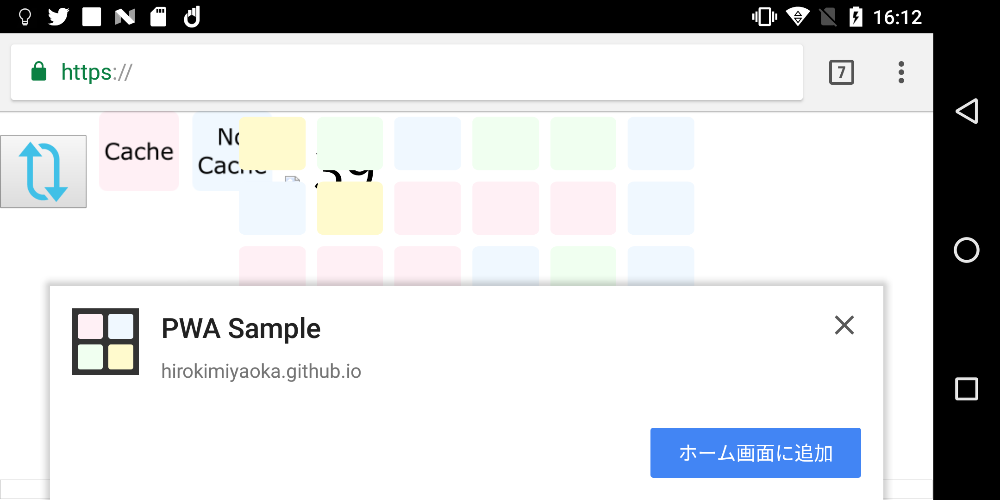

条件を満たすとこのような通知が出ます。（Chromeのみ。暫定）

+++

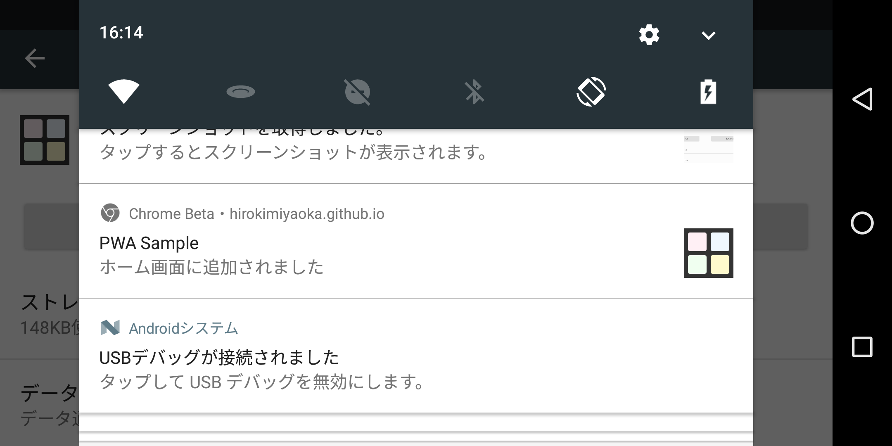

インストールできます。

+++

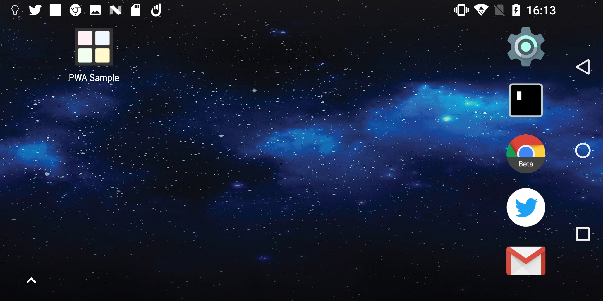

ホーム画面に追加されるとこんな感じです

+++

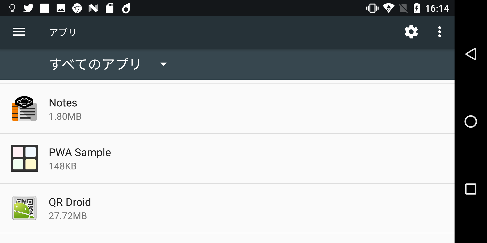

設定→アプリから見ると、このようにストアからインストールしたものと同じように並んでいます。

+++

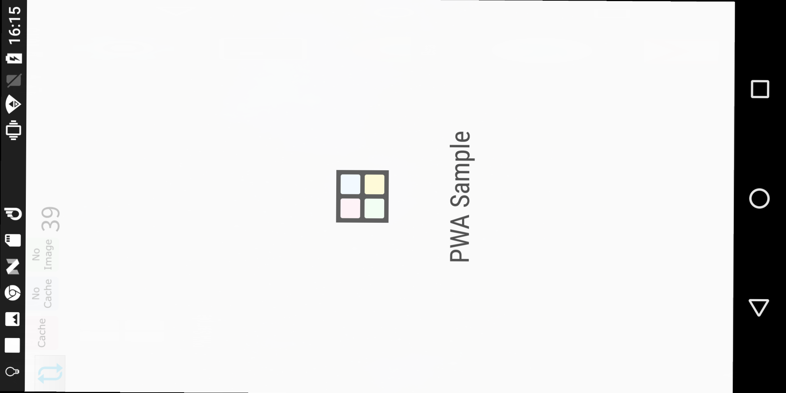

起動するとこのようなスプラッシュを表示した後起動します。ちなみに縦固定なのでSSを横にしました。

+++

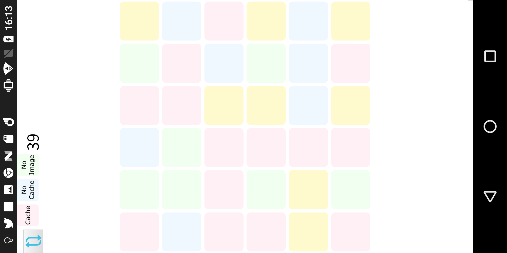

このようにURLバーなどブラウザUIを消すことができます。

+++

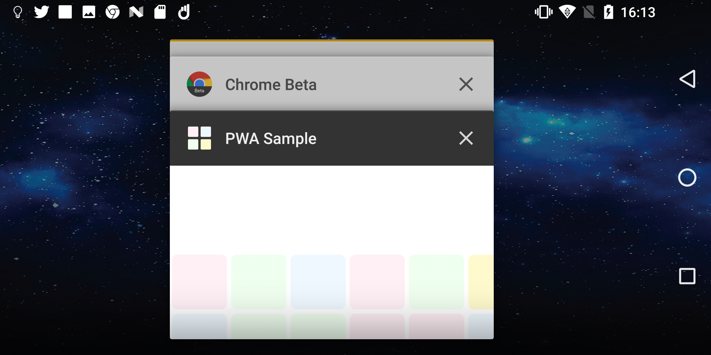

完全に単体アプリのように動作し、タスクキルもできます。

---

## SWのライフサイクルを知る

+++

### SWの仕組み

SWは以下のような仕組みで動いています

* ブラウザ外のJS環境で実行され、イベントごとに処理を登録する
    * SWはイベントが発生すると登録した処理を実行する単純構造
* 同じドメインでも複数のSWを登録可能
    * 複数のSWをインストールしても、同じscopeの場合1つのSWのみが対応
    * 違うscopeなら別々に対応

+++

### 実行環境

* DOM操作等のAPIがなく、ブラウザ側の情報にアクセスできない
    * 通信処理を書けば情報やり取りは可能
* `location` はサーバーのSWが置いてあった場所を基準にする
* 以下のように `self` オブジェクトに対してイベントを登録する

```
self.addEventListener( 'install', (event) => { /*インストール時の挙動*/ } );
```

+++

### SW自体のキャッシュの挙動

SWは常に新しいもので動作させたいため、以下のようにして極力新しいSWを取得するようにしています。

* 古いSWはブラウザキャッシュを無視してダウンロードが走る
    * 登録したスクリプトは基本キャッシュヘッダに従う（予定）
    * ただし1日以上古いSWは絶対に許されず、1日を超えると必ずキャッシュを無視してダウンロードされる
* ブラウザ/アプリ側(クライアント側)から更新依頼を投げることも可能
    * あくまで依頼

特に何も考えなければ、1日以内ですべての環境が新しいスクリプトになるという認識です。

+++

### 新しいSWと1つしか動かないSW

ここまでをまとめると以下のようになります。

* SWはブラウザとは異なるJS環境で動作する
* ドメインとscopeが同じSWは1つしか動かない
* SWは極力新しいものをインストールしようとする

では、複数のクライアントを古いSWで制御しているとき、新しいSWが来たらどうなるでしょうか？
もし強制更新がかかった場合、古いSWと対応した古いクライアントは、動作に不整合を起こす可能性があります。

そこで、より安全に運用するためのライフサイクルがあります。

+++

### 基本的なライフサイクル

SWには状態が3つあります。

* インストール
    * SWのスクリプトをダウンロードしてブラウザにインストールする段階
    * クライアント側で `register` を実行することで始まる
* 待機
    * 現在稼働中のSWが制御しているクライアントがある場合に待機する段階
    * 1つでも古いSWとつながっているクライアントがあれば、強制更新を書けない限り待機し続ける
* アクティブ
    * 正常にインストールされ、対象のクライアントを制御している段階

+++

### ライフサイクルの例

* 初回アクセス時
    * インストール→待機
    * 特に何もしていないと初回はSWは動かない。
* 次回アクセス時
    * SWが古くないならすでにアクティブなので、初めからSWの制御下
* 次回アクセス時更新あり
    * SWが古いのでインストールが走る→稼働しているSWがあるので待機→制御中のクライアントがすべて終了したらアクティブ
    * 古いSWが稼働して、さっき見つけた新しいSWが動作するわけではないことに注意！！
        * 公式では、この次にアクセスしたときには最新になってるだろう。みたいな感じで書いてある

1,3番目がある意味の鬼門です。

---

## 通常のSWの挙動を確認するサンプル

+++

### 犬を猫にする

ライフサイクルを確認する簡単なサンプルを見てみます。

* 犬の画像(dog.svg)を表示
* SW側ではfetchイベントを登録
    * 犬の画像(dog.svg)をリクエストされたら猫の画像(cat.svg)のリクエストに差し替える
* SWをインストール要請5秒後に犬の画像(dog.svg)をもう一枚表示
    * この時間にはSWのインストールは終わっているだろうということで。

1枚目は犬、2枚目は猫が表示されるはず？

+++?code=docs/2_dog2cat/index.html&title=/Slide_PWA_0/2_dog2cat/index.html

HTMLではSWの登録と5s後に `dog.svg` を表示するコードが書かれています。

+++?code=docs/2_dog2cat/sw.js&title=/Slide_PWA_0/2_dog2cat/sw.js

+++

### fetchイベントの登録

```
self.addEventListener( 'fetch', ( event ) => {
	console.log( 'SW:', 'fetch', event.request.url );
	const url = new URL( event.request.url );

	if ( url.origin == location.origin && url.pathname == '/Slide_PWA_0/2_dog2cat/dog.svg' ) {
		event.respondWith( fetch( '/Slide_PWA_0/2_dog2cat/cat.svg' ) );
	}
} );
```
@[5](犬の画像のリクエストを探す)
@[6](猫の画像のリクエストに書き換え、その結果を犬の画像のレスポンスとして返す)
@[9](何もしない場合は通常のリクエストがそのまま走る)

+++

### 挙動

このサンプルは以下のような挙動になります。

* 犬の画像(`dog.svg`)が表示される
* SWがインストールされるが、すぐには有効化されない。
* SWによるリクエストの差し替えが発生しないため、5s後に犬の画像(`dog.svg`)を表示すると、犬の画像を表示する
* リロードするとSW制御下に入るので、犬の画像(`dog.svg`)を表示すると、SWが猫の画像(`cat.svg`)のレスポンスを返し、猫の画像を表示する

このように、SWは登録してもすぐに有効化するような記述がないと、リロード後にしか効果を発揮しません。
これが通常の挙動です。

+++

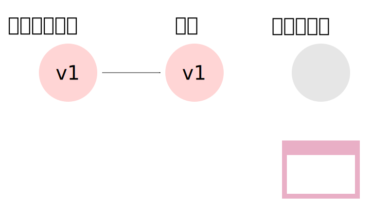

+++


+++

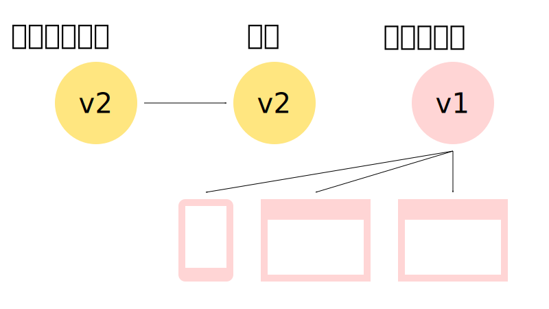

+++


+++

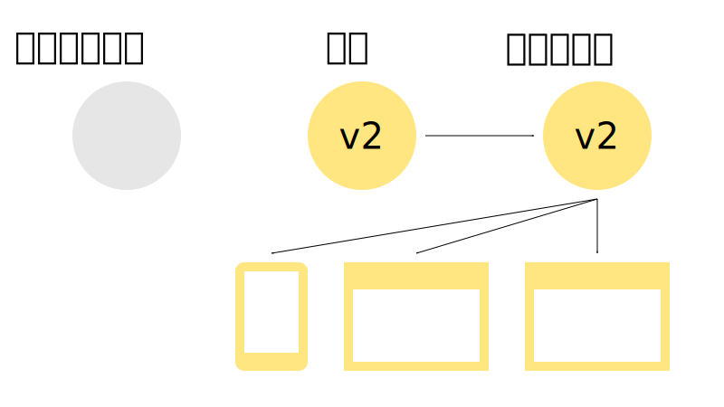

---

## すぐに有効化するサンプル

+++

### 新しいSWをすぐに有効化したい

SWインストール後すぐに有効化します。

これにより、犬の画像を表示した後猫の画像が表示されるはず……！

+++?code=docs/3_dog2cat_update/sw.js&title=/Slide_PWA_0/3_dog2cat_update/sw.js

+++

### 更新後すぐに適用

```
self.addEventListener( 'activate', ( event ) => {
	console.log( 'SW:', 'activate' );
	event.waitUntil( self.clients.claim() );
} );
```
@[3](これを入れるとSWの制御下に入る予定のページすべてで新しいSWを有効化します)

+++

### 挙動

先ほどから一行加えただけですが、以下のようになります。

* 犬の画像(`dog.svg`)が表示される
* SWがインストールされ、このページはSW制御下にないのですぐに有効化される
* SWによるリクエストの差し替えが発生するため、5s後に犬の画像(`dog.svg`)を表示すると、SWが猫の画像(`cat.svg`)のレスポンスを返し猫の画像を表示する
* リロードするとSW制御下に入るので、1枚目の犬の画像(`dog.svg`)を表示すると、SWが猫の画像(`cat.svg`)を返し猫の画像を表示する

+++

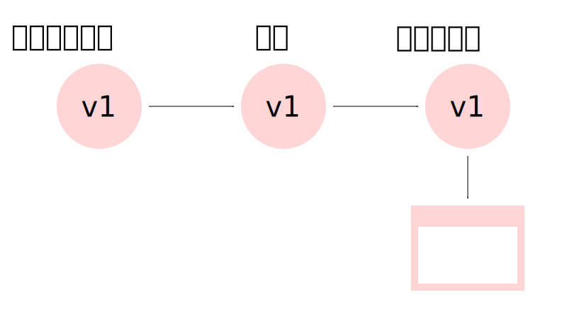

このようにすぐにSWが稼働しますが、ページ読み込み開始からの制御はできないので、途中から稼働を始めます。

+++


ただし、すでに今別のバージョンが稼働中の場合は待機します。

---

## 現状一番強いSWを更新するサンプル

+++

### 強制更新は発生しない

途中からとはいえ初回アクセス時にSWが動くようになりました。
が、先ほどの画像で説明したように、同じSW制御下の別クライアントがいる場合、そのクライアントがすべて閉じられない限り有効化されません。
つまり以下のような挙動になります。

* 犬の画像(`dog.svg`)を猫の画像(`cat.svg`)に変換するSWが稼働中
* 犬の画像(`dog.svg`)を鳥の画像(`bird.svg`)に変換するSWに更新
* SWがインストールされるが、旧SWが稼働中のため、待機状態になる。
* 旧SWのまま動作する。

これも解決するためには、次のようにします。

+++?code=docs/4_dog2cat_omake/sw.js&title=/Slide_PWA_0/4_dog2cat_omake/sw.js

+++

### インストールしたら待機状態にしない

```
self.addEventListener( 'install', ( event ) => {
	console.log( 'SW:', 'install' );
	event.waitUntil( self.skipWaiting() );
} );
```
@[3](これによりインストール後待機状態にしないため、activateの時にすべてのクライアントのSWが更新されます)

+++

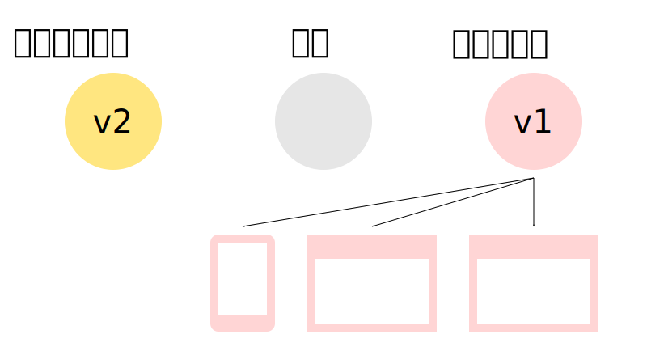

+++

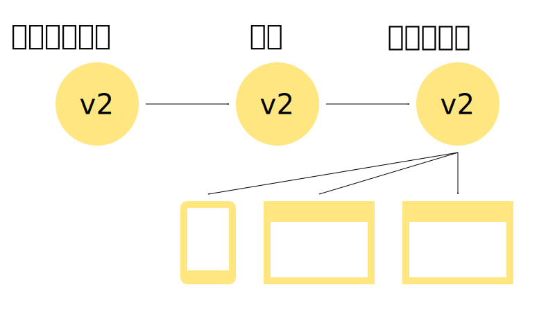

他にSWが動いていようが関係なく即座にこの状態に持っていきます。

---

## 通信を利用して、さらに挙動を見てみる


+++

### 今回やってみること

とりあえずライフサイクルの基本的な挙動は見れたので、もう少し踏み込んだ挙動について見てみます。

* ボタンを押すとSWと通信をしてバージョンを確認できるようにする
* 更新を検出してみる
* 更新してみるボタンと、何が何でも絶対更新するボタンを作ってSWの手動更新をしてみる

+++?code=docs/6_update_found/index.html&title=/Slide_PWA_0/6_update_found/index.html

+++

### クライアントからSWにメッセージを送る（通信）

```
function SendMessage( data ) {
    if ( !( 'serviceWorker' in navigator ) ) { return; }
    const channel = new MessageChannel();
    navigator.serviceWorker.controller.postMessage( data, [ channel.port2 ] );
}
```
@[3](SWと通信するために準備します)
@[4](channel.port2がSW側なので、そこにデータを送ります)
@[10](メッセージの受信は後で出てきます)


+++

### クライアント側でのアップデートの検出

`navigator.serviceWorker.ready` は初回ならインストールが終わりSWの最低限の準備が出来次第呼ばれるPromiseで、その引数として渡される `registration` に更新を検出するイベントを登録することができます。

具体的には次のように使います。

+++

### 新しいServiceWorkerの登録処理

```
function InitServiceWorker( suffix ) {
    if ( !( 'serviceWorker' in navigator ) ) { return Promise.reject( 'No ServiceWorker' ); }
    navigator.serviceWorker.register( './sw.js' + ( suffix || '' ), { scope: './' } );
    return navigator.serviceWorker.ready.then( ( registration ) => {
        if ( !registration.active ) { throw 'ServiceWorker not active.'; }
        return registration;
    } );
}
```
@[2](Promiseを返す構造に変更)
@[4](インストール後に返ってくるPromise)
@[4,5,6](登録情報周りのオブジェクトを返す)

+++

### メッセージの受け取り、アップデート依頼

ボタンやSWとの連動の関係上、DOM構築後にいろいろやります。

```
document.addEventListener( 'DOMContentLoaded', () => {
    InitServiceWorker().then( ( registration ) => {
        console.log( 'Init' );
        // 次で見る:メッセージの受け取りやアップデート依頼
    }, false );
    // 次の次で見る:強制更新を試す
} );
```

+++

### メッセージの受け取りやアップデート依頼

```
        registration.addEventListener( 'updatefound', ( event ) => {
            console.log( 'updatefound:', new Date() );//location.reload();
        } );
        navigator.serviceWorker.addEventListener( 'message', ( event ) => {
            console.log( 'Get message:', event.data );
            document.getElementById( 'printver' ).value = event.data.version || '';
        }, false );
        document.getElementById( 'update' ).addEventListener( 'click', ()=> {
            registration.update();
        } );
```
@[1,2,3](SWの更新が見つかった場合に呼ばれる。ここでリロードなどを行ったりする)
@[4,5,6,7](SWからメッセージが来たときに呼ばれる。今回はバージョンしかないのでそれを表示する)
@[8,9,10](SWを更新してみる。ただし更新されるとは限らない)

+++

### 強制更新を試す

```
    document.getElementById( 'force' ).addEventListener( 'click', () => {
        InitServiceWorker( '?' + Math.random() );
    }, false );
    document.getElementById( 'version' ).addEventListener( 'click', () => {
        SendMessage( { message: 'Please SW version.' } );
    }, false );
```
@[1,2,3](強制的にSWを更新する)
@[4,5,6](SWにメッセージを送り、バージョン番号を要求する)

+++?code=docs/6_update_found/sw.js&title=/Slide_PWA_0/6_update_found/sw.js

+++

```
self.addEventListener( 'install', ( event ) => {
	console.log( 'SW:', 'install', 'ver:' + VERSION );
	event.waitUntil( self.skipWaiting() );
} );

self.addEventListener( 'activate', ( event ) => {
	console.log( 'SW:', 'activate' );
	event.waitUntil( self.clients.claim() );
} );
```

挙動が見やすいため、強制更新にしておきます。

+++

### メッセージの受け取り&返信

```
self.addEventListener( 'message', ( event ) => {
    console.info( 'SW:', 'message', event.data );
    event.waitUntil( self.clients.matchAll().then( ( clients ) => {
        clients.forEach( ( client ) => {
            console.log(client);
            client.postMessage( { version: VERSION, visible: client.visibilityState, count: ++count } );
        } );
    } ) );
} );
```
@[1](クライアント側からのメッセージを受け取るイベント)
@[3](クライアントの一覧を取得する)
@[4,5,6,7](各クライアントにバージョン番号などを送る)

+++

### 下準備

まずは以下の状態にします。

* 初回ページを開く
* 新しいタブを開いて2ページ目を開く

+++

### バージョンの要求

* 2つのページのうち、片方でSWのバージョンを要求するボタンを押す
* 片方のページでバージョン番号が返ってくる
* もう片方のページを開くと、そちらにもバージョン番号が返ってきている

とりあえずSWとの通信には成功します。
SWは複数クライアントでも1つしか起動せず、またSW経由で他のクライアントに対して何らかの作業を行わせることが可能です。

+++

### 更新してみる

新しいSWを更新してみるボタンを押してみると、多分何も起きないです。
これは以下のようになっているからです。

* 更新依頼が来たのでSWのスクリプトを見る
* ブラウザのキャッシュがある、1日経過していないなどの場合は何もしない
* 上のキャッシュ回避条件が整っている場合、再インストール処理が走り、クライアントのundatefoundイベントも呼ばれる

多分下の挙動は見れないと思いますが、このようにある程度ブラウザがSWのスクリプトのキャッシュを持っているため、一筋縄では更新できません。

+++

### 強制更新をやってみる

強制更新は、無理矢理URLを変更したSWのスクリプトを登録することで可能です。
実際には以下のようになります。

* キャッシュのないSWなのでダウンロード・インストールなどが発生し、updatefoundイベントも呼ばれる
* リロードした場合、今回の場合はブラウザキャッシュにある古いSWのスクリプトが呼ばれ、それが再インストールされてしまうため、古いバージョンが有効化される

つまり、SWを強制更新する場合は、リロードした時の対策も必要になります。

+++

### 立ちふさがる問題

SWの更新にはいろいろな問題があります。

* SWの更新をどうするか
    * 強制更新するかしないか
    * URL末尾の変更などでSW更新対策ができるが、どう更新していくか
    * 待機回避のために非活性なクライアントのSW領域外への遷移など、様々な対策を考える必要がある
* キャッシュをどうするか
    * 例えばHTMLページをSWでキャッシュしてしまった場合、ちゃんとキャッシュを制御しないといつまでもキャッシュを持ち続けてしまう

+++

### 対処法

* 強制更新+登録するSWにキャッシュ回避措置+更新検出時にリロード+ページをキャッシュしないor更新時に破棄
    * 今活性化しているクライアントに合わせて、他のクライアントにも完全更新をする処理を入れる
* 更新検出時にSW制御外or避難先のSWを登録しているページに遷移
    * 更新してくださいページ(稼働しているSW範囲外)に他クライアントを退避させて制御下から外す
* SWとクライアントのバージョンを持っておき、あらゆるところで比較・異なる場合にはリロード
* リロード時に必ず新しいSWをインストールする
    * キャッシュ回避時に必ず

サービスによっていろいろ選択肢はあると思いますが、このライフサイクル部分は初めにどうするか決めて、ちゃんと実装しておく必要があります。

---

## まとめ


+++

* PWAは今までのWebアプリで不可能だった様々な動作を可能とする
* SWはライフサイクル周りが地獄
    * 他はイベント発生時に処理するだけなのでそうでもない
    * 設定によっては不整合を防ぐ仕組みがSWの更新を大幅に妨げてしまう
        * 不整合とかどうでもいいから新しいのを適用する方法もあるが、それでも更新問題は残る
* キャッシュに関してはいろいろあるので初期段階で何か考えておくこと
    * SWへのキャッシュはヘッダや1日ルールがあるので、場合に応じて適切なキャッシュ対策を施す必要がある
+++

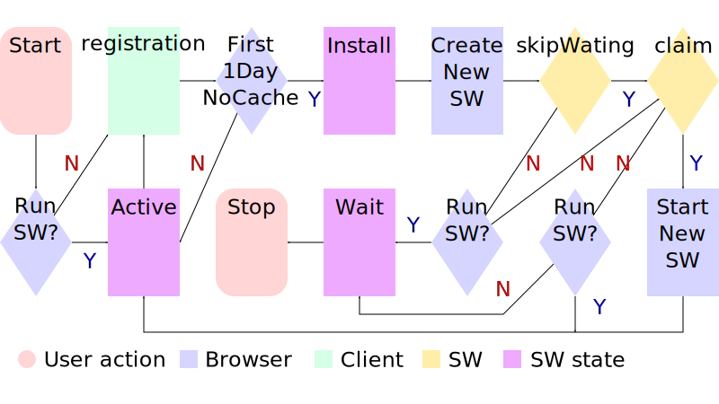

ライフサイクル周りは単純に見えてやたら複雑！！（これも正確には正しくない！）
導入初期段階で何とかしましょう。

---

## 補足

+++

### こまごまとしたメモ

* SW側でデータを保持しておきたいんだけど変数でいい？
    * NO! ポンポンインストールが走ってすぐ消えるので、DBなど永続化するものを使うべし
* PWAのインストールバナーって何度も出るの？
    * 条件未定だがブラウザベンダーごとに決められる。Chromeの場合暫定ではあるが、×ボタンだと14日以降、明示的に拒否した場合は90日以降に出るとか
    * ブラウザ次第だし、でなくなるかもしれない。一応ブラウザメニューからはいつでも可能
* PWAのインストールバナーって出せるの？
    * プログラムで呼び出すことは現在不可能。Push通知ですらうるさいとユーザーに不評すぎるので、多分自分で出せる日は来ないと思う
* updatefoundって新しいのがインストール後にくる？
    * 何かインストール中とかにもくるっぽい。これに関してはさらにステータス監視してインストール未届けが可能なので、その処理が必要
* SWって1ファイルだけ？
    * importみたいな命令(`self.importScripts`)があって、それを使えば複数ファイルに分割されていても大丈夫

+++

### サポートツール

* Lighthouse
    * https://chrome.google.com/webstore/detail/lighthouse/blipmdconlkpinefehnmjammfjpmpbjk?hl=ja
    * 何かよくないこととか検出してくれる
        * ただしエラーが明確とは限らない

+++

### SWのlocationサンプル

```
{
	hash: "",
	host: "example.com",
	hostname: "example.com",
	href: "https://example.com/XXX/sw.js",
	origin: "https://example.com",
	pathname: "/XXX/sw.js",
	port: "",
	protocol: "https:",
	search: ""
}
```

+++

### SWの削除

```
navigator.serviceWorker.getRegistrations().then(function(registrations) {
    for(let registration of registrations) {
        registration.unregister();
    }
});
```

+++

### 参考資料とか

* Service Worker のライフサイクル
    * https://developers.google.com/web/fundamentals/primers/service-workers/lifecycle?hl=ja
* Service Worker API
    * https://developer.mozilla.org/en-US/docs/Web/API/Service_Worker_API
* ウェブアプリのインストール バナー
    * https://developers.google.com/web/fundamentals/app-install-banners/?hl=ja

---

時間が余ったらもう少し何かする。

* SW側でのクライアントリソースのキャッシュ
* SWでXXXXXを作る

---

## キャッシュ利用例

もう少し複雑なこととして、リクエストの書き換えではなく、あらかじめ猫の画像をキャッシュしておき、それのレスポンスを返すこととします。
SW以外は同じ挙動とします。

* install時には猫の画像をあらかじめダウンロードしてキャッシュする
* activate時には古いキャッシュを探してすべて削除する
* fetch時には犬の画像の時に猫の画像のキャッシュを返す

+++?code=docs/5_dog2cat_cache/sw.js&title=/Slide_PWA_0/5_dog2cat_cache/sw.js

+++

```
const DOMAIN = 'sample_static-v';
const CACHE_VERSION = 1;
const CACHE_NAME = DOMAIN + CACHE_VERSION;
```

キャッシュ用の定数達です。
キャッシュのバージョンは固定文字列+バージョン番号で管理されますが、自分で作ったキャッシュを正確に消すために分けてあります。

+++

```
self.addEventListener( 'install', ( event ) => {
	console.log( 'SW:', 'install' );
	event.waitUntil( caches.open( CACHE_NAME ).then( ( cache ) => {
		cache.add('/Slide_PWA_0/5_dog2cat_cache/cat.svg');
	} ).then( () => {
		return self.skipWaiting();
	} ) );
} );
```
@[3](キャッシュを今のバージョンで開きます)
@[4](猫の画像をダウンロードしてキャッシュに追加します)
@[10](SWを待機状態にしません)

+++

```
self.addEventListener( 'activate', ( event ) => {
	console.log( 'SW:', 'activate' );
	event.waitUntil( caches.keys().then( ( keys ) => {
		return Promise.all(
			keys.filter( ( key ) => {
				return key.indexOf( DOMAIN ) === 0 && key !== CACHE_NAME;
			} ).map( ( key ) => {
				console.log( 'Delete cache:', key );
				return caches.delete( key );
			} )
		);
	} ).then( () => {
		return self.clients.claim();
	} ) );
} );
```
@[3](キャッシュのキーを列挙します)
@[5,6,7](バージョン番号前まで一致し、それ以降が異なるキーのみを抽出します)
@[9](古いキャッシュを削除します)
@[20](SWを有効化します)

+++

```
self.addEventListener( 'fetch', ( event ) => {
	console.log( 'SW:', 'fetch', event.request.url );
	const url = new URL( event.request.url );

	if ( url.origin == location.origin && url.pathname == '/Slide_PWA_0/5_dog2cat_cache/dog.svg' ) {
		event.respondWith( caches.match( '/Slide_PWA_0/5_dog2cat_cache/cat.svg' ) );
	}
} );
```
@[6](キャッシュから猫の画像を引っ張り、そのレスポンスを返します)

+++

### 挙動

* 犬の画像(`dog.svg`)が表示される
* SWがインストールされ、猫の画像をキャッシュする
* 犬の画像(`dog.svg`)がリクエストされたとき、キャッシュにある猫の画像(`cat.svg`)のレスポンスを返す。
* リロードするとSW制御下に入るので、犬の画像(`dog.svg`)を表示すると、SWが猫の画像(`cat.svg`)のキャッシュからレスポンスを返す
    * サーバーの猫の画像にはリクエストが飛ばない

+++

### SWの準備

新しい準備は `install` にて行い、`activate` で入れ替えるための作業をしておくと、スムーズにSWの切り替えができます。

今回は `install` で必要なリソースのキャッシュを作成し、`activate` で古いキャッシュの削除を行っています。

+++

### キャッシュの利用方法

今回は猫の画像しかキャッシュしませんでしたが、以下のような使い方が可能です。

* 最低限動作可能なファイル群をキャッシュしておき、キャッシュに存在するリソースはすべてキャッシュから返す
    * いわゆるオフライン対応
    * 今回のケースならHTMLやJSファイルもキャッシュする
* 存在しない画像をあらかじめキャッシュしてある仮画像に差し替える
    * クライアント側では404のエラーが出ない
* リクエストするたびに結果をキャッシュし、次回以降アクセスが発生しないようにする
    * SNSのアイコンをキャッシュしてリクエストを抑えるなど
